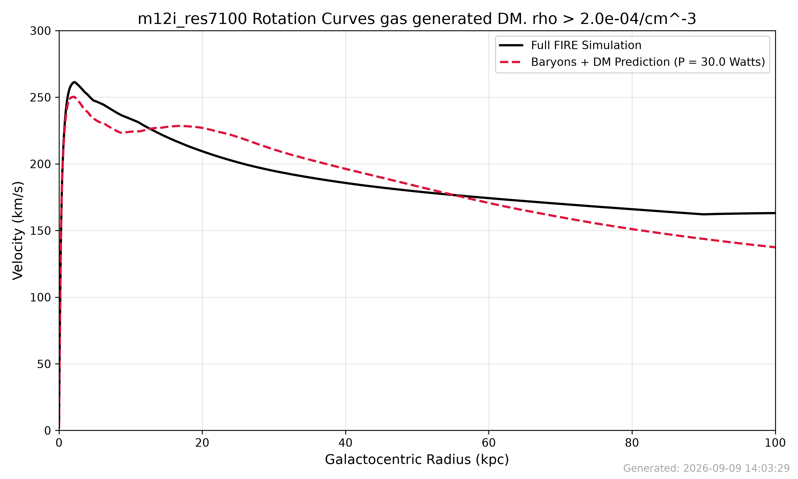

# Dark Matter Rotation Curve Simulator

This repository contains `darkmatter.py`, a script designed to analyze mock catalogs from the FIRE (Feedback In Realistic Environments) cosmological simulations. It extracts particle data (stars, gas, dark matter) to compute rotation curves and tests a custom theoretical model for predicting dark matter distributions based on baryon density.

## Overview
The script performs the following core steps:
1. **Data Loading:** Uses the `gizmo_analysis` package to load specific snapshots of simulated galaxies (e.g., `m11e_res7100`, `m12i_res7100`).
2. **Filtering:** Isolates dense gas and optionally stars within a given radius limit.
3. **Custom DM Model:** Predicts a Dark Matter distribution (Shared Power P) derived directly from the spatial distribution and density of baryons (gas and stars).
4. **Velocity Curves:** Calculates the circular velocity contributions ($v = \sqrt{GM/r}$) for each component.
5. **Visualization:** Generates and saves rotation curve graphs to compare the true FIRE simulation dark matter with the model's predictions.

## Requirements
Ensure you have the following Python packages installed:
- `numpy`
- `scipy` (for `cKDTree` local density calculations)
- `matplotlib`
- `gizmo_analysis`

To run this, you will also need the FIRE simulation data folders (e.g., `m11e_res7100`) located in the same directory as the script.

## Configuration
You can configure the simulation parameters at the top of `darkmatter.py`:
- `SIM_FOLDER`: The name of the simulation directory to load (e.g., `"m11e_res7100"` or `"m12i_res7100"`).
- `SNAPSHOT_NUM`: The specific snapshot index to read (default is `600`).
- `DENSITY_THRESHOLD`: Minimum density ($cm^{-3}$) used to filter the gas particles.
- `USE_STARS`: Boolean to toggle whether stellar mass contributes to the predicted Dark Matter distribution.
- `PLOT_X_LIMIT`: Sets the maximum galactocentric radius (in kpc) displayed on the output graphs.

## Usage
Run the script using python:
```bash
python darkmatter.py
```

## Outputs
The script will output progress to the console and generate the following PNG files:
- `plot_1_total_rotation_curve.png`: A comparison of the total rotation curve between the standard FIRE simulation and the custom predicted DM model.
- `plot_2_component_decomposition.png`: A breakdown of the velocity contributions by individual components (stars, gas, true DM halo, and predicted DM halo).


